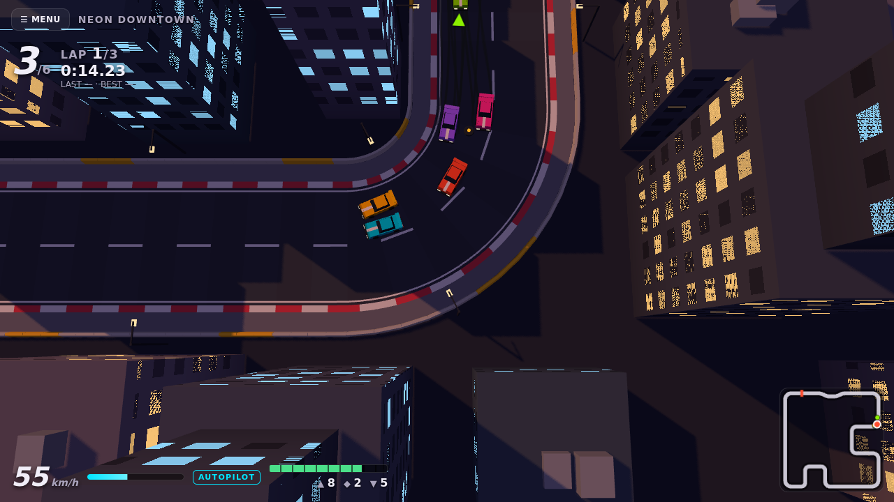

# NITRO CARNAGE

<!-- version -->**v0.1.19**<!-- /version --> — the build currently on Pages.

A top-down 3D combat racer that runs entirely in the browser, for 1–6 players with
**no game server**. It is a spiritual successor to the Amiga-era arcade combat racers:
short races on tight circuits, missiles front and rear, mines, and a shop between races.
Everything here is original: the name, the tracks, the meshes and the sound.

**[▶ Play](https://sheppio.github.io/nitro-carnage/)** — create a room, share the link,
up to six players. Bots fill the empty grid slots.



> **Milestone 7 of 8: a new track every day.**
> - **Track of the day.** A circuit generated from today's date: the same track on
>   every computer on Earth until UTC midnight. Type any word to get a track of your
>   own, and share the word.
> - **Hotlap** has replaced free drive: you, the clock and your record on each track,
>   with live splits at every checkpoint.
> - **Race only.** Rooms and quick races can switch the weapons off.
> - **Also in the game:** the Garage's five body styles and liveries (M6); three
>   hand-built circuits with a train, a quay and synthesised sound (M5); weapons (M4);
>   and rooms of up to six (M3). Every screen works from the arrow keys, a controller or
>   a touchscreen.
>
> A shop and championship are deferred to M8, and may not happen. [`PLAN.md`](PLAN.md) has the whole design.

The screenshot is regenerated by `node scripts/screenshot.mjs` from a real race in
headless Chromium. It lives in `docs/`, not in the game, which still loads no image
files at all.

---

## Stack, and why

The architecture follows our previous game, [glitchburst](https://github.com/Sheppio/glitchburst),
wherever it fits.

| Choice | Reason |
| --- | --- |
| **three.js 0.186** | Real 3D is the point: skyscrapers that lean away from the centre of the screen as you drive past. It is confined to `src/render/`, so it stays swappable. |
| **TypeScript, `tsc` only** | No bundler. `tsc` emits plain ES modules to `dist/`, which is committed. |
| **CDN import map** | `three` and `mqtt` resolve to jsDelivr at runtime, so there is nothing to install to *play*. We load `build/three.module.js`, not a `.min.js`: the npm package no longer ships a minified build, and we would rather load a file we know exists than rely on the CDN minifying on the fly. |
| **GitHub Pages** | The whole game is static files. Push to `main` and it deploys. |

## Running it

Playing needs nothing but a web server:

```bash
npm run serve      # http://localhost:8080
```

Developing needs the compiler:

```bash
npm install
npm run watch      # tsc --watch, rebuilding dist/ on save
npm test           # 315 checks: simulation and networking (Node), and real browsers
```

Add `?debug` to the URL for an fps and draw-call readout, and `?quality=low` to
override the graphics preset.

`dist/` is committed on purpose, because it is what GitHub Pages serves.
**Rebuild and commit it with any change to `src/`.** CI fails if they drift, and the
pre-commit hook bumps the version and rebuilds for you.

---

## Architecture

```
src/
├── sim/      car physics, collisions, tracks-as-data, the fixed-step World — pure
├── input/    keyboard, gamepad, touch → one DriveIntent
├── render/   everything three.js: camera, track mesh, instanced scenery, cars, effects
├── ui/       DOM overlay and gamepad menu navigation (ported)
├── net/      MQTT transport, room and host election, clock sync, codecs,
│             dead reckoning, and NetRace (one client's view of a networked race)
├── clock.ts        injectable time: real, fake (tests) or worker-pumped (hidden tabs)
├── RaceSession.ts  one race on screen: read input, step or follow the room, draw
├── RoomClient.ts   one room in the browser: broker, NetRace, background ticker
└── main.ts   wiring
```

`sim/`, `net/` and `input/sources` import neither three nor the DOM, and `net/` takes
its clock and its message bus as parameters. That is what lets `test/sim.test.mjs`
drive a car round a whole track in Node in a fraction of a second, and
`test/net.test.mjs` run rooms of up to seven clients through races, host crashes and
frozen tabs in under two seconds, with no browser and no waiting.

### A fixed 60 Hz step

The simulation advances in exact `1/60` s steps, and rendering interpolates between
the last two. Wall-clock time goes in, whole steps come out, and the remainder
carries over. The physics therefore sees the same sequence of steps whether the
screen runs at 24 Hz, 144 Hz or not at all. Two players on different hardware
simulate the same race, and a test proves it: the same wall time fed in at 144 Hz
and at 24 Hz gives the same number of steps and a bit-identical car.

Interpolation costs one step (16 ms) of latency. Without it, a 144 Hz monitor shows
each position two or three times and then jumps, which reads as the car stuttering.

A tab that slept for ten seconds does not wake up and simulate ten seconds in one
frame. Each frame's time is clamped to a quarter of a second before it reaches
the accumulator. The cost of that is deliberate: a renderer managing fewer than four
frames a second runs the race slower than real time rather than in jumps.

### The car: a bicycle model, not a physics engine

There is one front axle and one rear axle, and each gets a lateral tyre force from
its slip angle, clamped by the grip of the surface under that axle. Drive is split
40/60 front/rear and shares each axle's grip through a friction circle. Everything is
integrated in the world frame, so the textbook rotating-frame terms are not needed.

- **Why not rear-wheel drive?** It was, at first. The rear tyres can only push as
  hard as they grip, and with 49% of the weight on them that capped acceleration at
  6 m/s², so 0–100 km/h took 4.8 s. It felt like a bus. Splitting the drive gives
  3.4 s and leaves enough at the rear for the throttle to steer the tail.
- **Slip angles against a floor speed.** At walking pace a slip angle is the ratio of
  two tiny numbers, and a stiff tyre acting on it rings. Below 3 m/s the maths uses
  3 m/s.
- **Counter-steer assist.** The front wheels lean towards the direction of travel in
  a slide. A keyboard player has full lock or nothing, and without the assist they
  cannot hold a drift at all. It only acts on slip *beyond* 0.12 rad: every
  ordinary corner has some slip, and the first version, acting on all of it,
  quietly wound off 40% of the lock the driver asked for (see *Tests* below).
- **Stability aids, off with the handbrake.** The car may rotate a little faster
  than its steering asks for, enough to feel the tail step out under power, and past
  0.3 rad of slide the velocity swings back towards the nose at the same speed. Only
  part of the drive force is charged against cornering grip. A true friction circle,
  with 60% of the drive at the rear, left the rear tyres almost nothing at full
  throttle. The handbrake switches all of this off, which is the point of the handbrake.
- **Steering lock tightens with speed.** It halves by 22 m/s. Full lock at 45 m/s
  would spin any car.
- **Height is a scalar.** A ramp is a wedge in the track data. When the ground drops
  away, the car keeps the climb rate the ramp gave it: that is the launch. In the air
  there is no steering and no traction, and a hard landing costs 10% of your speed.

| Surface | Grip | Extra drag |
| --- | --- | --- |
| Tarmac | 1.00 | — |
| Kerb / pavement | 0.95 | light |
| Dirt | 0.70 | medium |
| Grass | 0.55 | heavy |
| Oil | 0.18 | — |

Drag matters as much as grip. Without it, cutting a corner across the grass would
be free.

Events such as landings and wall impacts are **monotonic counters**, not flags. The
renderer runs after however many fixed steps fitted in the frame (zero, one or
several), so a flag set in one step and cleared in the next could be missed. A
counter that only goes up cannot be.

### Collisions that cannot tunnel

The car is a **capsule**: a segment along its length inflated by a 1 m radius. That is
cheaper than a box, it slides along a wall instead of catching its corners on every
joint between wall segments, and from 56 m up nobody can tell a rounded bumper from
a square one.

Walls are one-sided segments pushed out along their own normal. Each step is split
into substeps so that the capsule moves at most half its radius per substep, and a
capsule cannot cross a segment without overlapping it on some substep. **Tunnelling is
impossible by construction**, not by luck. The test fires a car at every fifth wall
segment of the track at *five times* top speed (255 m/s) and checks that none gets
out. glitchburst learned this lesson from bullets passing through enemies. Here it
went in from day one.

### Tracks are data

A track file (`src/sim/track/downtown.ts`) exports one `TrackDef` object and nothing
else. It lists the corners, road width, pavement, start line, checkpoints, ramps and
scenery rules. `buildTrack()` turns that into a 1 m arc-length table, wall segments, a
surface lookup and seeded scenery. The files are TS rather than JSON because a
`tsc`-only build and the Node tests can both import them with no loader, and the
compiler then checks the data.

**The centreline is straights joined by circular fillets, not a spline.** Each corner
of the control polygon carries a radius. That radius is the one number that decides
both how fast the corner can be taken and whether the inside wall (offset by half the
road plus the pavement) folds back over itself. With a spline that would have to be
discovered. With a fillet it is written down, and a test checks every corner leaves
room for its wall.

Scenery is scattered from the track's seed, so every client will build the same city.

### Racing: laps you cannot cheat, and an order that never jumps

A lap is tracked from each car's arc length along the centreline (`sim/race.ts`,
pure). Cars start on the grid *behind* the line, so a car begins on lap "−1
completed": crossing the line the first time starts lap 1 and finishes nothing.
After that a lap only counts once every checkpoint has been passed in order, and
**reversing over a checkpoint or the line un-passes it**. Driving back over the line
and forwards again gains nothing, and a test does exactly that three times.

Lap times are interpolated *inside* the step. The crossing happens somewhere between
two 60 Hz steps, and the tracker works out where from the distance either side. A
16 ms quantum would decide photo finishes by rounding.

Race order is finishers by finish time, then everyone else by **distance covered**:
a running total of metres, continuous across the line and across respawns. The
obvious `laps × length + s` jumps a whole lap if a car is respawned behind the line
it just crossed, and the order would flicker. Ties break on id, so every client
sorting the same data (from M3) gets the same order.

**Respawns.** A car that has crawled for 3 s while its driver is trying to go, or has
been off the course for 1 s, goes back on the centreline 12 m behind the last place
it was on the road and heading the right way. It is placed stationary and pointing
along the track, and it is a **ghost for 2 s**, so it cannot be dropped into
somebody. WRONG WAY shows after 1.5 s of going backwards.

**Cars touch.** Car-against-car is capsule against capsule, with the impulse applied
to each side separately, because in M3 each client will resolve only its own car.

### The racing line and the autopilot

The bots, the self-driving test clients and the player's optional autopilot all use
one pure policy (`sim/autopilot.ts`):

- **The line** (`sim/racingLine.ts`) is a minimum-curvature line. Each point relaxes
  towards the midpoint of its neighbours while clamped inside the road, which cuts
  apexes and runs wide on entry and exit. It runs on a 3 m grid, because relaxation
  spreads a correction one point per iteration and a 1 m grid would need nine times
  as long to settle the long bends. On Neon Downtown the line sits over 5 m to the
  inside of the tight corners.
- **The speed profile** is what the car can corner at each point, followed by a
  backwards pass from every slow corner that brakes into it in time. It plans 16 m/s²
  of cornering and 16 of braking. The first version planned 10.5 and 11, well inside
  the car's limits "to leave a margin", and play-testing called it at once: the bots
  were timid in every corner. At 16 the best bot laps in 59 s instead of 66.5, still
  without touching a wall. At 18 they start clipping walls.
- **Steering** is pure pursuit: aim at a point on the line a speed-scaled distance
  ahead, and steer the arc that reaches it. The output is eased, because pure pursuit
  re-decides every step and a 60 Hz twitch reads on screen as a car vibrating.
- **Overtaking and room.** A slower car close ahead in our lane gets passed on the
  side with more road. A car *alongside* gets a lane's width. Without that, the two
  cars in every grid row turned into each other the moment the lights went green:
  a six-bot start produced shunts at 8–13 m/s, and now produces 2–4 m/s rubs.
- **Recovery.** Crawling or pointing the wrong way, it reverses out steering the
  opposite way, before the respawn rule would have to step in.
- **Skill** is three numbers per bot: pace (a fraction of the profile's speed, 94–100%
  across the grid, once 86–97%), wander (how far it strays off the line), and whether
  it uses the turbo on straights.

The fastest bot laps Neon Downtown in 59 s and the slowest in about 62. Six bots race
three laps in under half a second of CPU in Node. Faster bots running side by side
through the kink do rub, so the race test's "no hard shunts" means nothing over
15 m/s. It was 8, which the timid bots met and the quicker ones do not.

**Laps are long.** About 60 s on a 1.6 km lap of right-angle corners is longer than the
plan's 35–45 s, and a three-lap race runs about 3 minutes. Worth deciding once the race
has been played: fewer laps, a shorter circuit, or more grip.

### The camera

The camera sits high overhead and looks almost straight down with a 10° forward
tilt. It is fixed **north-up**: the car turns on screen, not the world. Everyone in a
race sees the same map, and the minimap agrees with the world.

**Perspective, not orthographic, is the whole trick.** The lens is 56 m up and towers
reach 34 m, so a roof sits well over halfway to the camera. As you drive past, the
buildings visibly lean away from the middle of the screen. That parallax is free: it
comes from the projection, not an effect. The tower height cap (0.6 × camera height)
is what stops a roof clipping through the lens.

- **Lead.** The camera looks along your velocity, by up to 22 m through a critically
  damped spring, so at speed you see where you're going and a sudden spin doesn't
  whip the screen round.
- **Speed.** The camera rises from 56 m to 68 m and the lens widens from 50° to 56°.
- **Shake** is trauma-based: hits add trauma, the shake is its *square*, and it decays
  linearly, so small knocks stay small. "Reduce camera shake" in settings scales it to
  a quarter.
- **Phones.** In portrait the lens widens until the narrow axis still shows 50 m of
  ground. Otherwise the view is a keyhole.

The camera started at 70 m. That made the car 4% of the screen height, which was
fine for admiring the city and bad for driving.

### Tall things must never hide a car

Buildings that cover a car are **cut away around it, not faded whole**. Fading whole
buildings pops a big tower out of existence because one corner of it covers a car. Each
building fragment asks two questions: is it nearer the camera than a car, and is it
close to that car on screen? If so, it is discarded through a 4×4 ordered-dither
pattern that thins out with screen distance. This is screen-door transparency:

- There is no sorting and depth stays correct.
- It is continuous in every input (car, camera, depth), so nothing ever pops. The
  depth test itself is softened over 1.5–4 m so the line where a wall passes the car's
  depth is not a seam.
- **Shadows are untouched**, because the shadow pass uses its own depth material. The
  tower still shades the car it has been cut away over, which is exactly right.
- About 6% of the building is left as a faint dotted ghost, so the hole reads as "you
  are behind this", not as a missing building.

It covers towers, rooftop clutter and lamp posts, which share one set of uniforms: up
to six cars' screen positions, updated once a frame.

**How often does it matter?** Less than you'd think, and the test that proved the
shader works is how we found out. A roof at height *h* can only cover the first
(*h*−1)/55 of the ground path from a car to the lens. So with the camera nearly
overhead, a car on the road on Neon Downtown is covered from roughly **one camera
position in six**, and nearly always right at the edge of the frame. The cut-away
matters more on the later tracks, where trees overhang the road and cranes cross it.

### Drawing a city at 60 fps

- **Instanced and chunked.** There is one `InstancedMesh` per kind of thing (towers,
  roof clutter, barrier blocks, lamp posts, lamp heads) per 160 m square. A single
  track-wide InstancedMesh has a bounding sphere the size of the city, so it is never
  frustum-culled and every tower is drawn every frame. Chunked, only the squares near
  the camera are. On *high* a frame is under 60 draw calls **including the shadow
  pass**, against a budget of 150, and a test holds it there.
- **Windows without textures.** Towers are a unit box scaled per instance. The shader
  recovers those scales from the instance matrix, so windows come out the same size
  in metres whatever the building's shape. It then lights a hashed subset per
  building, warm or cool, and the city glows at dusk. There are no image files anywhere.
- **A shadow box that follows you.** One directional light lights everything, but its
  shadow map only covers 150 m around your car. That box moves in steps of exactly one
  shadow texel, measured in the light's own frame. A box that slides smoothly
  re-samples every shadow edge each frame, and the edges crawl.
- **Tyre marks** are a fixed ring buffer of quads. New marks overwrite the oldest, fade
  by age in the shader, and only the slots written this frame are uploaded.
- **Particles** (smoke, verge dust, sparks off walls) are one pooled `Points` draw.
  When the pool is full the oldest particle is recycled: a fresh spark at a crash is
  worth more than the tail of old smoke.

| Quality | Pixel ratio | Shadows | Particles | Draw distance |
| --- | --- | --- | --- | --- |
| Low (phones) | 1.0 | blob only | 300 | 180 m |
| Medium | 1.25 | 1024², hard | 900 | 260 m |
| High | 1.5 | 2048², soft | 2000 | 360 m |

Every car also keeps a soft blob shadow. On *low* it is the whole shadow, and on every
setting it is what grows and fades while you are in the air, so the height of a jump
reads from straight above.

### The city had a moat

The first scenery scatter dropped any lot whose bounding *circle* came near the road.
With 12–18 m footprints that circle is about 12 m in radius, so the city stood 30 m
back from every street. There was a moat of dark ground and nothing that could lean
over a car. The test that searches for a car hidden behind a tower found no such
place anywhere on the track, which is how it came to light. The scatter now tests the
footprint's own corners and edge midpoints, and shrinks a building to fit before
giving up on its lot. The city comes right up to the pavement.

---

## Multiplayer: six players, no server

The rules are glitchburst's, ported (`net/RoomSession.ts`):

- **The host** is the alive player with the lowest time-prefixed id: whoever arrived
  first. It heartbeats twice a second. Miss 2.5 s of beats and every client re-sorts;
  exactly one promotes. Two hosts at once (a partition healing) resolve on the
  heartbeat and on presence alike: the lower id wins.
- **Presence** has a Last Will, so a crashed tab is de-listed at once. A 15 s timeout
  is only the backstop. A client that finds a gap of more than 2 s since its own last
  roster tick knows *it* was asleep, and forgives everyone rather than dropping the
  room and electing itself.
- **A seventh arrival** ranks itself seventh in the same sort and backs out.
- **Colours** are unique: clashes resolve by seniority, then the next free colour.
  Bots take the colours nobody is wearing.

What is new is the race:

| Thing | Who decides | How |
| --- | --- | --- |
| Your car | **you** | published at 20 Hz, and early whenever peers' prediction of it drifts 0.35 m or 4° |
| Everyone else's car | **its owner** | extrapolated to *now*, not interpolated into the past |
| A bump | **both** | each client moves only its own car and sends the other's share to its owner, who applies it unless it felt the contact itself |
| Phase, grid, GO, finish order | **the host** | on the heartbeat; finish order by the finishers' own time stamps |
| Bots | **the host** | driven and published like any car; adopted on failover |

### One clock

All shared timing (GO, lap and finish stamps) is in **room time**: the host's clock.
Clients ping the host, and of the last eight round trips they trust the fastest,
because the fastest trip is the least likely to have queued on one leg only. They
slew towards it rather than stepping. In the Node suite, clients whose clocks are
17 seconds apart agree to within a millisecond.

**Failover keeps the clock continuous.** A promoted host serves its *current estimate*
of room time, not its own raw clock, which differs from the dead host's by however
long the two machines have been up. GO still means the same instant: across a host
crash the room clock drifts 0.1 ms.

### Seeing the others: dead reckoning

Interpolating remote cars draws them 100–150 ms in the past. At 45 m/s that is more
than a car length, and in M4 you would be firing at cars that are not there any more.
Each remote car is instead **extrapolated to now** with a constant-turn-rate model:
its velocity rotates with its yaw rate, so a car mid-corner is predicted along its
arc rather than off the tangent into a wall.

When a packet arrives the prediction usually disagrees a little with what is on
screen. The difference is kept as an error that decays over about 100 ms, so the car
glides onto its corrected path. Beyond 10 m, or on a respawn, it snaps. Through a
60–150 ms link with 5% loss, a peer draws a car within **0.29 m** (95th percentile)
over a whole lap, and its heading within 3.4°.

### The race carries on

Every client keeps the last heartbeat. When the host's tab closes mid-race, the next
client in line promotes itself within 2.5 s, adopts the race from that heartbeat
(phase, GO, grid, finishers), and takes the bots over from where it last saw them,
driving them on. The browser suite closes the host's tab mid-race and checks the race
still finishes on the other two.

A player who arrives mid-race spectates: the camera follows the leader, and they are
on the grid for the next race.

### Background tabs

A browser throttles a hidden tab's timers to once a second, and after five minutes to
once a *minute*, and it stops drawing frames altogether. A host in a background tab
would miss every heartbeat and be voted out of its own room. So the room's timers run
on a clock pumped by a tiny Worker (created from a Blob, so there is no extra file),
whose messages are not throttled, and while the tab is hidden that same ticker steps
the race and drives the bots. The browser suite stops a host's frames entirely: it
still heartbeats at the full 2 Hz.

### The budget

With six cars racing (three humans and three bots, all publishing), the Node suite
measures **20 packets a second per car**, 7.9 KB/s into the broker, and **47 KB/s out**
at six subscribers. That is about half of what glitchburst already runs on these
public brokers. A car state packet is at most 54 bytes, and a full heartbeat 168.

## Weapons

| Weapon | Button | Flight | Damage |
| --- | --- | --- | --- |
| Front missile (10 per race) | Z / J, RB | 90 m/s, 1.4 s, stops at walls | 20 |
| Mine (3) | X / K, LB | dropped behind, armed after 0.6 s, lasts 45 s | 30 |
| Rear missile (5) | X / K, LB, once the mines are gone | 70 m/s backwards | 20 |

Health is 100. A wall hit faster than 12 m/s costs 1.4 health for every m/s over that.
At zero the car is **wrecked**: it burns for 2.5 s, then returns to the road with 35
health, ghosted for two seconds. The kill goes to whoever caused it, and to whoever
last shot the car if a wall finishes it within 4 s. Nobody can fire for the first
4 s after GO, because a six-car grid is otherwise a firing range. A wreck costs time,
not the race, which keeps a six-player race full.

### A missile's flight is decided when it is fired

A missile flies straight at a constant speed. So when it's fired, **one ray cast
against the walls** says how far it will get, and from then on its position is a
function of time alone. There is no stepping and nothing to drift:

- **Late packets don't matter.** A shot that arrives 150 ms late on another screen
  isn't fast-forwarded. It is simply evaluated at a later time, and it's already in
  the right place.
- **Walls stop it in the same place everywhere**, because every client casts the same
  ray against the same walls. A test fires 200 shots in random directions from all
  over the track, and none gets past a wall.
- **It's drawn at the same interpolated moment as the cars**, so it moves as smoothly
  as they do.

The ray is cast from the car's centre, not the muzzle. A car with its nose against a
wall would otherwise start its shot on the far side of the wall.

### Who decides a hit

This follows PLAN §5.1, the same trade-off glitchburst made:

- **The shooter decides.** Only the shooter's copy of a missile can hit anything. It
  is tested against the cars as the shooter sees them, swept along the step's flight
  so a missile that covers 1.5 m a step can't skip over a car.
- **The victim applies.** A hit goes out as one small event, and the victim's own
  client takes the damage, once. It is keyed on shooter and shot number, so a repeated
  message is not a second hit. The victim's next state packet carries the new health
  to everyone.
- **Mines work the other way round.** The car that drives over a mine notices it,
  takes the damage, and tells everyone to clear it.
- **A wreck is announced by its victim**, naming the killer, so every screen credits
  the same kill.

On the shooter's screen, then, a hit is exact and instant. The victim may see what
looked like a near miss, and that's the price of zero-latency hits and exactly one
decision per hit. A host that adopts a bot after a failover carries on its shot
numbering from the last number it saw, so the bot's next mine can't be mistaken for
an old one.

### Tuning, measured

The first numbers were those in PLAN.md: 30/25/35 damage, a 2 s start grace, and bots
allowed to fire every 1.2–2.6 s. A 6-bot, 3-lap race in Node produced 13 wrecks, and in
the browser the player lost 90 health in the first 14 seconds. The numbers are now
20/20/30 damage, a 4 s grace, and 3.5–7 s between a bot's shots. The same race now has
**5–7 wrecks, about one per car per race**. The measurement is a sim test, so a
change to the tuning shows up there.

## Three tracks, and what is on them

| Track | Lap | Character |
| --- | --- | --- |
| **Neon Downtown** | 1.59 km | a walled city grid at dusk; right angles, a chicane, the plaza jump |
| **Greenbelt** | 1.49 km | fast parkland sweepers; grass verges, stretches with no wall at all, a gravel section, a jump over the creek |
| **Tidewater Docks** | 1.62 km | container canyons under an overcast sky; the open quay, oil patches, the railway |

The track is picked in the menu for offline races and by the host in the lobby. It
rides in the heartbeat as an index, so a room always races the same one.

**The train sends no messages.** It runs on a timetable measured from GO: the first
pass 18 s in, then every 42 s, alternating direction. Its position is a pure function
of race time (`sim/train.ts`), and every client already agrees on race time, so every
client runs the same train. So does a late joiner, with no extra message. A network
test races three clients on the Docks and finds the train at the same metre on all of
them. The crossing's lights and booms come on 5 s before the train reaches the road.
Bots read the same timetable and wait at the line. A car that doesn't wait is shoved
clear and badly hurt, and that is the owner's own client applying it to its own car,
like every other collision.

**Water** is a rectangle on the track: off the road inside it, you're put straight
back on the road. **Wall gaps** remove the barrier along a stretch on one side, which
gives Greenbelt its open lawns and the Docks its quay. **Oil** is a patch of the
existing low-grip surface: steer across it and the car hardly turns.

### Faster tracks, a better autopilot

Downtown's corners are slow, so the autopilot had never been asked to hold a
long, fast sweeper. On Greenbelt it kept full throttle mid-corner. With the drive force
eating the grip that holds the car in the bend, it ran wide onto the grass at 28 m/s
and fishtailed from verge to verge, with 63 wall contacts in two laps. Two lines fixed
it:
- **Traction control.** Past 0.16 rad of slide, throttle is capped; past 0.28 it's
  off.
- **Grip-aware target speed.** Off the tarmac, target speed scales with the square
  root of the grip.

Greenbelt now laps with no contact at all, and Downtown's lap time moved by 0.7 s.
Seeded tracks (M7) will throw every kind of corner at it, so this was worth doing now.

## Sound

Everything is synthesised with Web Audio, and there are no sound files:
- **Engines.** Two detuned oscillators through a lowpass filter. Pitch climbs through
  six gears and drops at each change, and the throttle opens the filter.
- **Tyres.** Squeal is band-passed noise, gated by how far the car is sliding.
- **Weapons.** Missiles are a noise burst over a falling saw wave, and explosions a
  noise sweep over a sine drop.
- **Everything else.** Countdown pips, lap chimes, a finish fanfare, the crossing bell
  and a two-note train horn.
- **Music.** A small synth band (bass, arpeggio, pad and drums) on a lookahead
  scheduler. A 25 ms timer schedules every note in the next 150 ms on the audio clock,
  which doesn't wander the way JavaScript timers do. The menu gets a slower cue
  without drums.

- **Only the nearest three engines are voiced.** Six at once is mud, and the
  distant ones don't tell you anything.
- **Volume sliders are squared**, so half sounds like half. A bus at zero **builds
  nothing** (no oscillators, no engines) rather than playing silence. A browser test
  mutes both buses and checks that not one node is started.
- **Audio needs a gesture.** Browsers only start sound from a key, click or touch, so
  the first one unlocks it. Some browsers don't count a controller press as a gesture,
  and on those the game stays silent until something else is pressed once.
- **Volumes live in Settings**, which the pause menu now opens without leaving the
  race. Offline the race stays paused underneath; online your car is held on the
  brakes. Back returns to the pause menu.

## A track from a word: the track of the day

Pick **Track of the day** in the menu or the lobby and you race a circuit generated
from today's date. Pick **Your own seed…** and type any word: the same word is the same
track for anyone, so a track can be shared by name.

**Same seed, same track, on every computer.** That rules out anything a different
JavaScript engine could compute differently, so the generator deals only in integers
until it hands over a `TrackDef`:
- **Random numbers** come from mulberry32, which is integer arithmetic, and draws
  become choices by exact integer maths.
- **Angles** are whole degrees, looked up in a table of cosines and sines rounded to
  integers. No two engines can disagree in the last bit of a `Math.sin`.
- **Corners** are whole metres.
- **The day** is the UTC date as `YYYY-MM-DD`, hashed. It's the same string
  everywhere at the same instant, and it changes at UTC midnight, not at your local
  one.

A candidate is a loose star of 7–11 corners in one of the three themes. It's thrown
away unless it passes the same validation the hand-built tracks do: an arcade lap
length, every corner wide enough for its inside wall, no walls crossing, and no two
stretches of road closer than 40 m. It's checked without scenery, since scattering a
city round a candidate only to reject it was most of the cost. Retries draw from the
same stream, so they're part of the determinism too. A seed takes 2.4 candidates on
average, about 6 ms.

The tests hold this to account:
- A table of seeds is **pinned to the exact bytes** of their tracks. Changing the
  generator would otherwise silently change yesterday's track of the day, and this
  makes that a decision.
- The browser generates the pinned track and gets the same bytes as Node.
- A thousand seeds all validate, and the autopilot laps a hundred of them cleanly.
- In a room, the host's heartbeat carries the seed rather than a track index, and a
  network test finds every client building the same generated track from it.

## Hotlap and race only

**Hotlap** replaces free drive. You drive alone, for as long as you like, with no bots
and no weapons:
- The HUD shows the lap you're on against your **record** for that track.
- At each checkpoint, a green or red split shows how far up or down you are on the
  record's time there.
- A faster lap becomes the new record.

Records are kept on the device, per track, and generated tracks are keyed by their
seed.

- **Every lap starts with full health.** Damage from the last lap is gone at the line.
- **Your ghost.** The record lap's path is recorded ten times a second: about 1,400
  whole numbers, a few kilobytes, saved with the record. A see-through copy of your car
  drives it beside you. It exists only on screen, so nothing can hit it. Played back
  against the real car, it is never more than 0.8 m off over a whole lap.
- **Ghost ahead by.** In Settings (also reachable from the pause menu), you can set the
  ghost to run up to 2 s ahead, so it shows you the line before you reach the corner,
  or switch it off. Near the line, a lead carries the ghost straight into its next
  lap.
- **The first lap is a standing start**, so a flying lap soon beats it, and the ghost
  then runs alongside you.

**The menu previews the track.** Pick a track, the track of the day, or type a seed,
and a small map of the circuit appears on its theme's ground. Beside it are the track's
name and style: theme, lap length, corners, and any jump, level crossing, water or oil.
It redraws as you type. A shared leaderboard would need a server, or the public broker's retained
messages, so it's left for later.

**Race only** turns the weapons off for a quick race (in the menu) or a room (the host
picks it in the lobby). It rides in the heartbeat, so every client agrees. The HUD
hides the ammo, and a network test checks that not one shot goes on the wire.

## Your car: the Garage

The Garage opens from the menu and from the lobby. It has a turntable preview (the real
`CarMesh` in a small renderer of its own) and five pickers:

| | Choices |
| --- | --- |
| Body | Coupé, Hatch, Muscle, Wedge, Buggy |
| Livery | none, twin stripes, offset stripe, side flash, chequered bonnet, number roundel |
| Stripe colour | any of the ten palette colours; it doesn't have to be unique |
| Wheels | silver, black, gold, body colour |
| Race number | 0–99, on the roof (and the doors, with the roundel) |

- **Looks only.** Every body shares the same handling and the same collision
  capsule, so choosing one is never a competitive decision. A browser test builds all
  thirty body and livery combinations and checks each stays inside the capsule's 4.4 ×
  2.0 m footprint and under 600 triangles.
- **Your colour is still the room colour.** It's picked in the lobby and unique per
  room, because it's how you tell cars apart on the minimap and in the results. The
  Garage shows it but doesn't change it. A stripe too close to the body colour is
  drawn darker so it still reads.
- **Six characters on presence.** The look travels as six base-36 characters
  (body, livery, stripe, wheels, and two for the number) on the presence message that
  goes out once a second. It never rides in the 20 Hz car packets, so the bandwidth
  budget doesn't move.
- **Bad data becomes the stock car.** A malformed look, or none at all from an older
  build, decodes to the stock Coupé, so a bad packet can't reach the renderer as
  something it can't build.
- **Bots are dressed from the room code and their grid slot**, so every screen dresses
  them the same way.
- **Easy to drive without a mouse.** The pickers are ordinary dropdowns, so the arrow
  keys, D-pad and touch all work on them unchanged, and LB/RB cycle the body from
  anywhere on the screen. The lobby roster draws each car as a little plan-view icon
  in its colour and livery, in 2D: one WebGL context per roster row would be absurd.

## Consoles and handhelds

The whole game plays from a controller alone: Steam Deck, Xbox (Edge) and PlayStation
(its browser, best effort). None of it has been tried on real hardware yet: the suite
drives a virtual pad in headless Chromium.

- **Every screen works from the pad** (the ported spatial navigator). Dropdowns cycle
  in place, because a native popup is browser chrome a pad cannot reach.
- **An on-screen keyboard** for your name and the room code. A text box is the front
  door to a room, and whether a console raises its own keyboard is up to the browser.
- **"Press Menu to lock the controller to this window."** Console browsers only pass
  pad input to a page that holds focus, and that button goes fullscreen and takes it.
- **Menu/Options in a race** opens a pause menu. Solo, the race stops. Online it
  cannot stop for one player, so your car is held on the brakes and the menu says so.
- **Button prompts match the pad**: A/B for Xbox and the Deck, ✕/○ for PlayStation,
  keys with no pad at all.
- **Steam Deck:** checked at 1280×800, where nothing is clipped or covered, and
  defaulting to Medium graphics.

## Controls

| | Drive | Steer | Handbrake | Front weapon | Rear weapon | Turbo |
| --- | --- | --- | --- | --- | --- | --- |
| **Keyboard** | ↑ / W, ↓ / S | ← → / A D | Space | Z / J | X / K | Shift |
| **Gamepad** | RT / LT (analogue) | left stick | A | RB | LB | B |
| **Touch** | pedals, right thumb | left-thumb slider | button | button | button | button |

Esc, the pad's Menu/Options or the ☰ button opens the pause menu. The rear-weapon
button drops mines while you have them, then fires rear missiles. The most recently
used device drives the car, so picking up a controller mid-race just works.

**Menus need no mouse.** The arrow keys or the D-pad/left stick move the focus ring.
Enter, Space or A/✕ selects, and Esc, Backspace or B/○ goes back. Left and right
change a dropdown in place. In a text field, left, right and Backspace belong to the
text; on a pad, A opens an on-screen keyboard. In a race the arrow keys drive, and
Esc opens the pause menu, which the same keys then navigate.

- **Keyboard steering winds in over 140 ms** and returns faster. Keys are digital, and
  full lock in one frame spins the car.
- **Gamepad.** A 0.15 per-axis drift floor, then a deadzone that rescales so the rim is
  still full lock (both ported from glitchburst). Triggers are read as `value`, so half
  a trigger is half throttle. It rumbles on landings and wall hits. Menus are driven by
  the ported spatial `GamepadNavigator`.
- **Touch.** Steering is a floating slider: wherever your thumb lands is centre, and
  only horizontal travel counts. Full lock is 110 px away, on a curve, so the first half
  of the slider is fine control, and the wheel winds in like the keyboard's. It used to
  be linear, instant and 70 px, and on an iPad any thumb movement at speed threw the car
  sideways. A thumb that drifts upward must not start braking. The
  layer exists only while driving: glitchburst learned that an invisible full-screen
  touch layer over the menu swallows every tap.

---

## Tests

```bash
npm test
```

315 checks across seven suites. The browser suites swap the CDN for a local three.js and a
loopback MQTT stub that relays over a `BroadcastChannel`, so several tabs share one
"broker" offline, and run Chromium on SwiftShader.

- **`sim.test.mjs`** (136, Node):
  - **Generated tracks:** pinned seeds generate byte-identical tracks; corners are
    whole metres; a seed is any word, whatever the case; the day's seed changes at
    UTC midnight and not before; a thousand seeds all valid; a hundred lapped cleanly
    by the autopilot; a split at every checkpoint; a race-only world ignores every
    trigger; a recorded lap plays back where the car was; a damaged ghost from storage is
    refused.
  - **Tracks, each of the three:** lap length; corner radius against the wall offset;
    no wall crossing another; the centreline clear of every wall; projection
    round-trips; ordered checkpoints; s = 0 at the start line; deterministic scenery;
    no building or container on the road; nothing on the railway or in the water; a
    railway crosses the road exactly once; an open verge really has no wall; six grid
    slots on the road and not touching; no tunnelling; the racing line; a clean
    autopilot lap within 5% of par.
  - **Hazards:** the train is a pure function of race time and alternates direction; it
    blocks the crossing for a few seconds with the lights on 5 s ahead; it never
    reaches past its rails; a car parked on the crossing is hit; six bots race the
    Docks, wait for the train, and none is hit; a car in the harbour is back on the road
    within a second; a car steering across oil barely turns.
  - **Physics:** 0–100 km/h time; top speed; turbo; braking distance; reverse; steering
    lock against speed; grip order tarmac > dirt > grass > oil; handbrake slides; no
    control in the air; landings; ramp launches; a minute of random input without NaN;
    full throttle through a corner never spins; an ordinary corner keeps most of the
    lock you asked for; at speed, full lock still turns the car.
  - **Collisions:** no tunnelling at 5× top speed into any wall; head-on bounces.
  - **Laps and order:** the grid run-up is not a lap; a full lap counts with its time;
    a missed checkpoint voids it; reversing over the line gains nothing; reversing over
    a checkpoint un-passes it; sub-step lap timing; wrong way; race order; a respawn
    behind the line costs metres, not a lap.
  - **Racing line and autopilot:** the line stays on the road and takes the inside;
    braking stays within plan; the autopilot laps cleanly inside par; six bots finish
    three laps with no respawns and no hard shunts; a bot backs out of a wall.
  - **Race rules:** nobody moves before GO; a car pinned against a wall is respawned
    after 3 s; a respawned car is a ghost for 2 s, then solid; car-to-car contact
    conserves momentum, and a one-sided resolve moves only its own car.
  - **Weapons:** a shot fired into two worlds, or spawned late, is in the same place;
    200 random shots never leave the track; a nose on a wall can't shoot through it;
    a front missile hits the car ahead for 20 and never its shooter; rear missiles
    once the mines are gone, with cooldowns; an empty rack fires nothing; nobody fires
    before the start grace; shots pass through ghosts and finishers; a mine is
    harmless until armed, then hurts once and is gone (its owner too); a wreck
    credits the kill, burns, and returns with 35 health, ghosted; walls hurt only past
    12 m/s, and credit a recent shooter; six armed bots finish three laps with some
    wrecks, and the same armed race twice is identical.
  - **Determinism:** identical worlds; 144 Hz against 24 Hz; stall clamping; a
    line-follower lapping cleanly and taking the ramp.
  - **Helpers:** interpolation, deadzones, framerate-independent smoothing, colour
    clash resolution.
- **`net.test.mjs`** (60, Node, an in-memory broker and a fake clock): the heartbeat
  carries the seed and the weapons switch, and an older one decodes as a built-in track
  with weapons on; a race-only room on a seed builds the same track everywhere with no
  shots on the wire;
  - **Codecs:** round trips; worst-case sizes (car ≤ 54 bytes, heartbeat ≤ 184);
    truncation; wrapped time stamps; a car look in six characters, every body and
    livery; malformed looks become the stock car; the look on presence, and an older
    build's presence still decoding; bot looks from a seed.
  - **Dead reckoning:** arcs, not tangents; a recorded lap through a lossy, jittery
    link; out-of-order packets.
  - **Clock sync:** convergence across skewed clocks; a latency change; no jump
    across a host crash.
  - **Rooms:** election; Last Will; a seventh client backs out; a split brain heals
    over presence alone; a tab asleep for a minute keeps its room.
  - **Races:** one grid and one GO everywhere; three clients and two bots to identical
    results and back to the lobby; a host crash mid-race (another client takes over
    within 3 s, drives the bot on, reaches the results); a late joiner spectates and
    then races; a rammed car is shoved, once; the bandwidth budget; a room racing the
    Docks, with the train at the same metre on every client.
  - **Weapons:** weapon events round-trip and stay small; a shot fired on one screen
    flies on the other, as scenery; the victim applies a hit once, seen on both
    screens, and a repeated hit message does nothing; a mine is placed where it was
    dropped, hurts the car that drives over it, and is cleared everywhere; a wreck
    credits the kill on every screen; an armed six-car race on a 3% lossy link reaches
    the results with every screen agreeing on every car's health.
- **`smoke.test.mjs`** (43, browser): the browser generates a seed's track to the same
  bytes as Node; a hotlap on the track of the day (named, a record, no position, no
  weapons) sets and keeps a record with its splits and path, then shows splits against it; a see-through ghost on the
  road, off or a second ahead as set; full health at every line;
  - **Boot and driving:** the name comes from the one constant; nothing invisible
    covers the menu; the world takes exactly 60 steps per second of (clamped) clock; ↑
    drives and ← steers left; the HUD shows speed.
  - **Camera:** the car sits behind centre at speed, and the lens widens.
  - **Pause and teardown:** Esc pauses a solo drive (the world stops); leaving tears
    the renderer down.
  - **Occlusion pixel test:** a car hidden by a tower shows 0 of 25 pixels without the
    cut-away and 19 of 25 with it.
  - **Race:** a countdown with every car held; after GO six cars race, with position
    and lap shown; the minimap draws the circuit; rivals out of view get arrows; a
    one-lap autopilot race ends on a results table with the player marked.
  - **Weapons:** Z fires a missile that is drawn and counted off the HUD; X drops a
    mine; a hit lowers the health bar; a car shot to zero is wrecked, says so, and
    comes back with 35 health.
  - **Garage:** all thirty body and livery combinations inside the footprint and the
    triangle budget, each striped livery drawing its stripe; the look kept across a
    reload.
  - **Tracks and sound:** Greenbelt and the Docks boot from a link with their scenery
    inside 150 draw calls; sound starts on the first key with the race music; only three
    engines are voiced with six cars; with both volumes at zero nothing is built.
  - **Budget:** high quality with shadows stays inside the draw-call budget, with no
    console errors.

- **`multiplayer.test.mjs`** (19, browser, up to four tabs): a room forms from a code
  and a share link; one host; colour clashes; a look chosen in one tab's Garage shows
  in the other's lobby; only the host can start; a missile fired
  in one tab flies in the other; a race to the
  same results on both screens and back to the lobby; the host's tab closed mid-race;
  a late joiner spectating; a hidden host with no frames still heartbeating; a tab
  frozen for 20 s waking without splitting the room.
- **`gamepad.test.mjs`** (17, browser, a virtual pad and nothing else): the Garage by
  pad (RB changes the body, the D-pad the livery) and at 1280×800; the lock prompt;
  Xbox and PlayStation prompts; the on-screen keyboard; menu to race; RT drives;
  Menu/Options pauses, A resumes; leaving; every row of Settings by D-pad; the menu,
  lobby and HUD at 1280×800.
- **`keyboard.test.mjs`** (27, browser, keys and nothing else): on the menu, settings,
  Garage, join, lobby, pause and results screens, a breadth-first search over the arrow
  keys reaches every control. It presses each arrow from every control reached so
  far, so it's exact, not a walk that might be lucky. The race number changes with the
  arrows; a typed seed shows its track on the menu. Also: the caret keeps left, right and Backspace in text fields; dropdowns
  change with left and right; Space toggles a switch; Esc goes back everywhere and
  resumes from pause without reopening it; Settings from the pause menu, a volume
  slider by arrows, and Esc back to the paused race; in a race the arrows drive.
- **`mobile.test.mjs`** (13, browser, an emulated phone in landscape, real touch
  events): the menu is all tappable; the touch layer is only up in a race; nothing
  covers a touch button or the pause button; no two HUD panels overlap; the pedal
  drives; a second thumb steers while the first holds the throttle; an upward thumb
  doesn't brake; a small thumb movement is a small correction; the missile button fires; pause and resume by tap.

These caught real bugs:

- **The heartbeat outgrew its budget** (M7). The seed and weapons switch added 10
  bytes to the worst case, 178 against 174. The byte-budget test failed, so raising
  the budget to 184 was a decision, written down in PLAN §5.9, not a drift.
- **Two columns of dropdowns can't be crossed without a mouse** (M7). A dropdown keeps
  left and right for itself (they change its value), so laying the Garage's pickers
  out in two columns left the right-hand ones unreachable from keys and pad. The
  reachability search found it; the Garage stays one column. The lobby is two columns
  (it had to be, to fit the Deck with its new rows) and passes the same search.
- **The lobby no longer fitted the Steam Deck** (M7): the new Weapons row and the
  Garage button pushed Leave room off the bottom of 1280×800. Found by the Deck layout
  check.

- **With the autopilot on, your own fire buttons did nothing** (M6). Only the
  autopilot's intent was used, triggers included. Found in CI: the cross-tab missile
  test waited for a bot to feel like shooting, and one CI race ended first. The test
  now fires deliberately, and your triggers work whoever is steering.

- **A phone could not pause** (M5). The steering zone takes the left half of the screen,
  and it covered the ☰ Menu button in the top bar. It now starts below the bar. Found by
  the new mobile suite's hit test.
- **An invisible train ran over cars 300 m from the crossing** (M5). When the train
  reached the end of the line it carried on past the buffers for its own length,
  across another road, before disappearing. It's now clipped to its rails. Found by the
  six-bot Docks race, where two bots were wrecked far from any railway.
- **Bots fishtailed round Greenbelt** (M5): full throttle through fast sweepers, as
  above. Found by the per-track clean-lap test.

- **Three settings could not be reached without a mouse** (M4). Vibration, Reduce
  camera shake and Autopilot are checkboxes at the left edge of their rows, while the
  dropdowns sit at the right edge. The navigator measured controls, not rows, so the
  dropdowns lined up "directly below" each other and down jumped straight past the
  switches, from the keyboard and from a pad. It now navigates by form row. Found by
  the new keyboard suite's walk of every screen.
- **A car standing still set off its own mine** (M4). Mines dropped 2.4 m behind the
  centre, which is under the car's own tail, so a parked car blew itself up the moment
  the mine armed. They now land clear of the tail. Found by a test that parks a second
  car on a fresh mine.
- **A shot fired with the nose on a wall burst on the far side of it** (M4). The flight
  started at the muzzle, 2.8 m ahead, which was already past the wall. It now starts
  at the wall when the wall is nearer.
- **There was no Back key on the keyboard** (M4). B did it on a pad, but Esc only
  worked in a race. Esc and Backspace now go back on every screen. The navigator takes
  Esc before the race's own handler does, so closing the pause menu with Esc doesn't
  reopen it on the same press.

- **Car state went out at 15.6 Hz, not 20.** The "is it 50 ms since the last send?"
  test runs once a frame, so on 16 ms frames it waited for the frame *after* 50 ms and
  sent every 64 ms. Sends now follow a schedule. Found by the bandwidth test, which
  expects 20 per car per second.
- **Reopening the pause menu left nothing focused.** The ported navigator skipped
  focusing an element it remembered focusing, but Resume had lost the browser's focus
  when the menu closed. The next D-pad press only put the ring back on Resume, and
  from a controller "Leave race" was unreachable. Found by the pad-only suite.
- **An Xbox pad got PlayStation prompts.** It calls itself an "Xbox *Wireless
  Controller*", and "wireless controller" is Sony's name, which was tested first.
- **The lobby's Start button was off screen, and unscrollable,** at 640×400 (a phone in
  landscape): menus centred their card and hid overflow. They scroll now. Found by the
  multi-tab suite, whose small tabs could not click Start.
- **Your colour picker showed the colour you asked for, not the one you got** after a
  clash, labelled "(taken)". Found in a screenshot.

- **Two cars on the same spot stayed welded together.** Car contact pushes along the
  line between the closest points of the two capsules, falling back to centre to
  centre. Two cars exactly on top of each other have neither, so the push was zero and
  they never separated. That could happen with two respawns onto one spot. Found by
  the ghosting test, which parks a car on a respawned one and waits for the ghost to
  wear off. They now separate sideways.
- **The bots crashed at every start** (see *The racing line and the autopilot*),
  found by the first screenshot of a race, where the player's car was sideways and
  last.

- **The car was hard to steer**, reported from the first playable build: it pushed
  wide off the throttle, and on the throttle the tail came round and it spun. Both
  were measurable once looked for. The counter-steer assist was treating the ordinary
  slip of every corner as a slide to catch, leaving the front wheels at 59% of the
  lock asked for. Full throttle into a corner reached 1.56 rad of body slip at every
  speed from 15 to 35 m/s, which is a spin. The fixes are the assist deadband, the
  stability aids and more grip (1.25 → 1.45). A test for each half of the report now
  fails against the old physics and passes against the new: peak slip is 0.44 rad and
  the wheels keep 95% of their lock.
- **Then: "can I steer more before it understeers?"** At 25–35 m/s on full lock the
  car turned at only 30% of the rate its front wheels asked for, because the fronts
  ran out of grip long before the rears. The front now has 5% more grip, a shade
  under the rear, and light downforce lets the tyres bite harder the faster you go.
  That gives 73% at full lock, with no spins. The balance is steep: at 1.08× front grip
  the car oversteers at full lock. The price is that a hard corner now carries enough
  slip for the counter-steer assist to act, so that check's floor is 75% of the lock
  asked for (the original bug left 59%).

- **The walls did not close.** Wall segments are laid every 2 m of centreline, and
  Neon Downtown is 1,589 m, which is odd. The last segment wrapped past the start line
  and overlapped the first, which left a snag exactly where every race starts.
  *No wall crosses another* found it.
- **The city moat** (see above), found by the occlusion test failing to find anything
  to test.
- **A check that promised more than the design does.** The browser suite first
  asserted 60 steps per second of *wall* time. CI's runner, compiling shaders just
  after boot, drew about two frames a second, and the quarter-second clamp turned
  that into 31 steps a second, exactly as designed. The check now measures steps
  against the clamped clock, which is what the World guarantees, and reports the
  wall rate alongside.
- **Test bugs, again.** The first "bot backs out of a wall" check counted the test's
  own teleport as 300 m of progress (492 m in 12 s from a standstill), and the first
  ghosting check only compared a constant with itself. Both were rewritten before
  they could vouch for anything.
- **Two bugs in the tests themselves**, both worth recording because they looked like
  physics bugs:
  - The first grip test measured yaw rate times speed and declared oil the grippiest
    surface. A car spinning on oil has plenty of yaw while going straight on. It now
    measures how fast the *velocity* turns.
  - The first occlusion search required the line of sight to *leave* a tower before
    reaching the car. That excluded exactly the towers standing next to it.

The browser suite polls for outcomes and never sleeps for a fixed time. At
SwiftShader's few frames a second, a sleep tuned on a laptop is a flake.

---

## Deployment

GitHub Pages deploys from a branch: `main`, folder `/ (root)`. `.nojekyll` is present
so nothing is filtered. To deploy, run `npm run build`, commit `dist/`, and push.

CI (`.github/workflows/ci.yml`) deliberately **does not deploy**. It typechecks,
fails if the committed `dist/` has drifted from `src/`, checks that this README's test
count and version agree with the code, and runs both suites.
